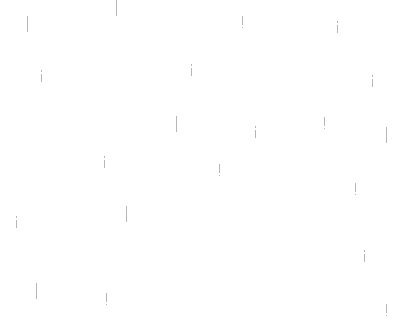

## Hi there 👋 I'm Rin

> i do a little coding, a little spaghetti code, and a lot of questioning reality

---

### 🧠 cooking (aka fighting my 6GB VRAM GPU):
- 🧠 Uncensored local LLMs on toaster-tier hardware
- 🖥️ Making Windows look like Linux, cuz I Arch too hard and refuse to touch anything else

---

### 🌱 learning things i probably shouldn't be:
- 🤖 AI finetuning (because why use ChatGPT when you can build your own **shit machine™**)
- 🎨 UI/UX design — mostly me screaming while AI writes cursed CSS
- 🧼 Cleaning up 3am spaghetti code with 3% memory of writing it

---

### 🛠️ current arsenal:
- **Languages:** JavaScript, Python  
- **Frontend:** HTML, CSS  
- **Backend:** Node.js, Flask  
- **Database:** SQLite  
- **AI/ML:** Ollama, OpenRouter.ai *(because why pay everyone individually?)*  
- **DevOps:** Docker, Cloudflared  
- **Tools:** VS Code, Git, WSL, VMware  
- **Package Managers:** npm, pip  
- **Shells:** PowerShell, Bash  
- **Cloud:** Google Cloud *(when it stops rejecting my card 😤)*

---

### 🔥 fun facts:
- I can only code `print("hello world!")`... and even that needed two StackOverflow tabs
- Used to live. Now I'm dead. (But funny dead.)
- Pronouns: she/her or he/him — just don’t call me *Good boy/girl*
- I break stuff to learn... then forget how I fixed it

---

### 💬 hit me up if you're into:
- AI ethics + weird philosophy questions
- Tech rants at 2am with zero structure
- Memes with lore
- Hating on NVIDIA while buying more NVIDIA GPUs (it's a toxic relationship)

---

> “Not tryna eat your cheeseburgers...  
> but if you leave them long enough, they *will* disappear into my fat ass.”

---

### 💀 Daily dose of fatherly wisdom:

